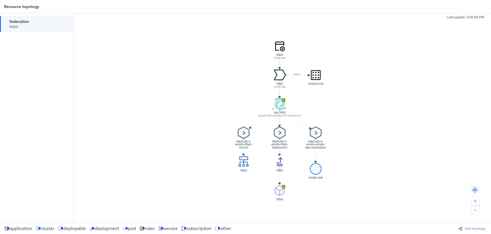

# Deploying and Managing a Project with GitOps 

Now that we have the clusters defined, let’s deploy a project which includes a service, namespace, and deployment.

This lab will use cluster1 only. The first step is to ensure that no resources currently exist in the *simple-app* namespace.
~~~sh
# Use the `oc` command to list deployments
oc --context cluster1 -n simple-app get deployment

No resources found.
~~~

## Deploy the application

The simple application we are using is an Apache web server serving a default index page.

The simple application includes the following resources:

-   A [Namespace](https://kubernetes.io/docs/concepts/overview/working-with-objects/namespaces/) for the deployment and service.
-   A [Deployment](https://kubernetes.io/docs/concepts/workloads/controllers/deployment/) of Apache web server.
-   A [Service](https://kubernetes.io/docs/concepts/services-networking/service/).

The [lab-4-assets](./lab-4-assets) contains definitions to deploy these resources.
For example: the [simple Apache deployment template](./lab-4-assets/deployment.yaml)

1- Change the directory lab-4-acm
~~~sh
cd lab-4-acm/
~~~

2- Ensure to load the "hubcluster" context
~~~sh
oc config use-context hubcluster
~~~

3- Create namespace 
~~~sh
oc create -f 01_namespace.yaml
~~~

4- Create channel 
~~~sh
oc create -f 02_channel.yaml
~~~

5- Create application 
~~~sh
oc create -f 03_application.yaml
~~~

6- Create placementrule for putting application just on Openshift cluster1
~~~sh
oc create -f 04_placementrule_cluster1only.yaml
~~~

7- Create subscription 
~~~sh
oc create -f 05_subscription.yaml
~~~

## Verify that the application is running

Verify that the various resources have been deployed. 

~~~sh
# The command below will display objects in the simple-app namespace
oc --context cluster1 -n simple-app get deployments,services,pods
~~~

Expose a route to allow for external ingress and verify the application can be queried.

~~~sh
# Expose the route for the httpd service
oc --context=cluster1 -n simple-app expose service httpd
# Get the Route hostname
url="http://$(oc --context=cluster1 -n simple-app get route httpd -o jsonpath='{.spec.host}')"
# We will wait 5 seconds to allow for proper propagation
sleep 5
# Access the route
curl -s $url | grep "This page"
~~~

## State Recovery

We are going to delete the deployment and watch RHACM will notice that the status is *unhealthy* and redeploy the deployment.

~~~sh
# Use the `oc` command to delete the httpd deployment object
oc --context cluster1 -n simple-app delete deployment httpd
~~~

As you can see the deployment is missing.
~~~sh
# Use the `oc` command to list deployments in the simple-app namespace
oc --context cluster1 -n simple-app get deployments
~~~

The deployment is missing so let's check to ensure RHACM deploying 

~~~sh
# Use this `oc` command to check application status
oc describe deployable -n simple-app  httpd-deployable

......
.....
        Statuses:
          /:
            Packages:
              Federation - Deployment - Httpd:
                Last Update Time:  2020-06-03T08:18:48Z
                Phase:             Subscribed
                Resource Status:
                  Available Replicas:  1
                  Conditions:
                    Last Transition Time:  2020-06-03T08:17:15Z
                    Last Update Time:      2020-06-03T08:17:15Z
                    Message:               Deployment has minimum availability.
                    Reason:                MinimumReplicasAvailable
                    Status:                True
                    Type:                  Available
                    Last Transition Time:  2020-06-03T08:16:39Z
                    Last Update Time:      2020-06-03T08:17:15Z
                    Message:               ReplicaSet "httpd-54b9dfb679" has successfully progressed.
                    Reason:                NewReplicaSetAvailable
                    Status:                True
                    Type:                  Progressing
                  Observed Generation:     1
                  Ready Replicas:          1
                  Replicas:                1
                  Updated Replicas:        1
                  
~~~

Verify the deployment is once again present after the synchronization.

***Please note: you may have to wait few seconds before the resources are correctly re-created.***

~~~sh
# Use the `oc` command to list deployments in the simple-app namespace
oc --context cluster1 -n simple-app get deployments
~~~

Connecting to RHACM WebUI you should see a topology like this:

[Home](./README.md)

