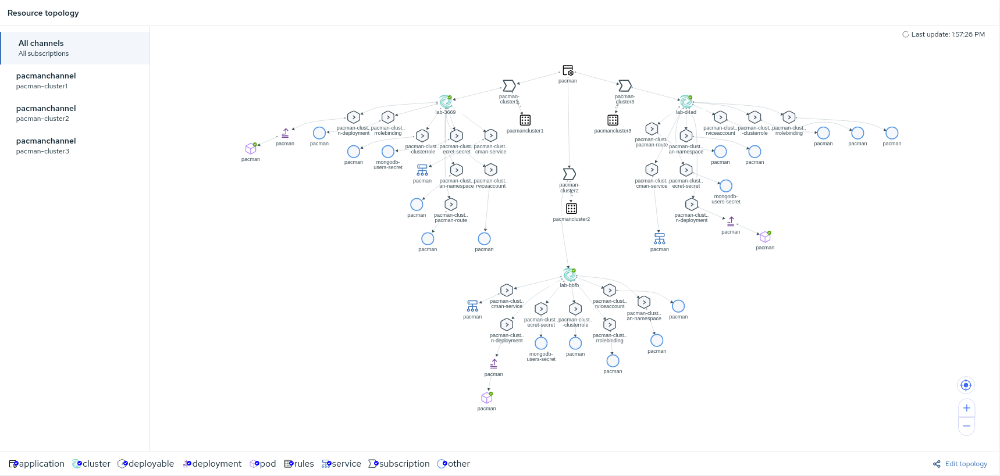

# Deploying Pacman

The files within the [directory](./lab-7-assets) are used by RHACM
Pacman on multiple OpenShift clusters.

## Architecture

Below is the architecture definition for our Pacman Application.


* There is a Pacman pod running on each OpenShift Cluster
* There is an HAProxy Load Balancer which load balances the traffic on 
`pacman.example.com` across the three Pacman replicas
* Pacman saves highscores into MongoDB, the connection string to the database includes
all the three replicas hostnames

**How a user accesses the Pacman application**

1. The user points their browser to `pacman.example.com`, the DNS server will return the IP Address of the HAProxy
2. The browser will send a request to the HAProxy asking for the host `pacman.example.com`
3. The HAProxy will lookup the available backends servers for the frontend configuration `pacman.example.com`
4. The HAProxy will reverse proxy to one of the available backends servers (pacman pods) using Round Robin as load balance mechanism
5. The user will be connected to the backend server and presented with the Pacman app

## Prerequisites

### Deploying HAProxy

We are going to deploy the HAProxy server on one of the clusters (`cluster1`), the HAProxy could be hosted externally as well.

1. Change directory to `haproxy-yaml`

    ```sh
    cd haproxy-yaml
    ```
2. Create the namespace where the HAProxy LB will be deployed
    
    ```sh
    oc --context hubcluster create ns haproxy-lb
    ```
3. Create the HAProxy Route for external access

    >  **NOTE:** HAPROXY_LB_ROUTE is what the diagram shows as `pacman.example.com`

    ```sh
    # Define the variable of `HAPROXY_LB_ROUTE`
    HAPROXY_LB_ROUTE=pacman-multicluster.$(oc --context=hubcluster get ingresses.config.openshift.io cluster -o jsonpath='{ .spec.domain }')

    # Use the value of `HAPROXY_LB_ROUTE` to create a route with the `oc` command
    oc --context hubcluster -n haproxy-lb create route edge haproxy-lb \
    --service=haproxy-lb-service --port=8080 --insecure-policy=Allow \
    --hostname=${HAPROXY_LB_ROUTE}
    ```
    >  **NOTE:** The HAProxy Route will be used as the Pacman application entry point. Since we want to have HA across clusters, we will be access Pacman application using our HAProxy rather than OpenShift Routes
4. Create the configmap with the HAProxy configuration file

    ```sh
    # Define the variable of `PACMAN_INGRESS`
    PACMAN_INGRESS=pacman-ingress.$(oc --context=hubcluster get ingresses.config.openshift.io cluster -o jsonpath='{ .spec.domain }')
    # Define the variable of `PACMAN_CLUSTER1`
    PACMAN_CLUSTER1=pacman.$(oc --context=cluster1 get ingresses.config.openshift.io cluster -o jsonpath='{ .spec.domain }')
    # Define the variable of `PACMAN_CLUSTER2`
    PACMAN_CLUSTER2=pacman.$(oc --context=cluster2 get ingresses.config.openshift.io cluster -o jsonpath='{ .spec.domain }')
    # Define the variable of `PACMAN_CLUSTER3`
    PACMAN_CLUSTER3=pacman.$(oc --context=cluster3 get ingresses.config.openshift.io cluster -o jsonpath='{ .spec.domain }')
    # Copy the sample configmap
    cp haproxy.tmpl haproxy
    # Update the HAProxy configuration
    sed -i "/option httpchk GET/a \ \ \ \ http-request set-header Host ${PACMAN_INGRESS}" haproxy
    # Replace the value with the variable `PACMAN_INGRESS`
    sed -i "s/<pacman_lb_hostname>/${PACMAN_INGRESS}/g" haproxy
    # Replace the value with the variable `PACMAN_CLUSTER1`
    sed -i "s/<server1_name> <server1_pacman_route>:<route_port>/cluster1 ${PACMAN_CLUSTER1}:80/g" haproxy
    # Replace the value with the variable `PACMAN_CLUSTER2`
    sed -i "s/<server2_name> <server2_pacman_route>:<route_port>/cluster2 ${PACMAN_CLUSTER2}:80/g" haproxy
    # Replace the value with the variable `PACMAN_CLUSTER3`
    sed -i "s/<server3_name> <server3_pacman_route>:<route_port>/cluster3 ${PACMAN_CLUSTER3}:80/g" haproxy
    # Create the configmap
    oc --context hubcluster -n haproxy-lb create configmap haproxy --from-file=haproxy
    ```
    >  **NOTE:** If you are curious about the HAProxy configuration, you can have a look at the `haproxy` file and review the frontend and backend sections
5. Create the HAProxy Service referenced in the HAProxy Route

    ```sh
    oc --context hubcluster -n haproxy-lb create -f haproxy-clusterip-service.yaml
    ```
6. Create the HAProxy Deployment

    ```sh
    oc --context hubcluster -n haproxy-lb create -f haproxy-deployment.yaml
    ```
7. Verify HAProxy is working

    7.1 Check for HAProxy deployment to be ready

    ```sh

    oc --context hubcluster -n haproxy-lb get pods
    NAME                          READY   STATUS    RESTARTS   AGE
    haproxy-lb-6f69d59979-z2hll   1/1     Running   0          25s

    ```
    7.2 Try to access HAProxy

    >  **NOTE:** 503 Service Unavailable means that no backend servers are available to handle HAProxy forwarded requests, but HAProxy is working fine.
    
    ```sh
    # Get the HAProxy LB Route
    HAPROXY_LB_ROUTE=$(oc --context hubcluster -n haproxy-lb get route haproxy-lb -o jsonpath='{.status.ingress[*].host}')
    # Access HAProxy
    curl -k https://${HAPROXY_LB_ROUTE}

    <html><body><h1>503 Service Unavailable</h1>
    No server is available to handle this request.
    </body></html>
    ```

## Deploying the Pacman Application

Now that the Mongo cluster has been configured, it is time to deploy the *pacman* application.

First, change to the directory of the Pacman demo folder.
~~~sh
cd lab-7-assets
~~~

For the *pacman* application, the file `pacman-deployment-rs.yaml` needs to reflect the MongoDB endpoint. The MongoDB endpoint is used to save scores from the game.
Provide the value of the MongoDB server(s) to be used for the scores to be recorded for the *pacman* game.

~~~sh
# Define the variable of `MONGO_CLUSTER1`
MONGO_CLUSTER1=$(oc --context=cluster1 -n mongo get route mongo -o jsonpath='{.status.ingress[*].host}')
# Define the variable of `MONGO_CLUSTER2`
MONGO_CLUSTER2=$(oc --context=cluster2 -n mongo get route mongo -o jsonpath='{.status.ingress[*].host}')
# Define the variable of `MONGO_CLUSTER3`
MONGO_CLUSTER3=$(oc --context=cluster3 -n mongo get route mongo -o jsonpath='{.status.ingress[*].host}')
# Use the variables to define the replica members
cp base/pacman-deployment.yaml.backup base/pacman-deployment.yaml
sed -i "s/replicamembershere/${MONGO_CLUSTER1},${MONGO_CLUSTER2},${MONGO_CLUSTER3}/g" base/pacman-deployment.yaml
~~~

A value must be provided to be the publicly accessible address for the *pacman* application.
~~~sh
# Define the variable of `PACMAN_INGRESS`
PACMAN_INGRESS=pacman-ingress.$(oc --context=hubcluster get ingresses.config.openshift.io cluster -o jsonpath='{ .spec.domain }')
# Replace the generic value with the variable `PACMAN_INGRESS`
cp base/pacman-route.yaml.backup base/pacman-route.yaml
sed -i "s/pacmanhosthere/${PACMAN_INGRESS}/g" base/pacman-route.yaml
~~~

Before committing our changes we need to update also the main Github repository in the file describe the "Channel" resource:

    ~~~sh
    sed -i 's/open-cluster-management/YOUR_GITHUB_USERNAME/g' lab-7-acm/02_channel.yaml
    ~~~


1. Commit the files to the git repo

    ~~~sh
    # Stage your changes to be sent to the git repository
    git commit -am 'Values for MongoDB Replicas and Ingress Hostname'
    # Push your commits to the git repository
    git push origin master
    ~~~

2. We will deploy it on cluster1, cluster2 and cluster3 via RH ACM. We will use kustomize and overlays for creating the objects as we will be using the values to modify replica count and the image.

    ~~~sh
    cd lab-7-acm
    ~~~
    1- Create namespace 
    ~~~sh
    oc create -f 01_namespace.yaml
    ~~~

    2- Create channel 
    ~~~sh
    oc create -f 02_channel.yaml
    ~~~

    3  - Create application
    ~~~sh
    oc create -f  03_application_pacman.yaml
    ~~~

    4- Create placement for each cluster 
    ~~~sh
    oc create -f 04_placement_cluster1.yaml
    oc create -f 04_placement_cluster2.yaml
    oc create -f 04_placement_cluster3.yaml
    ~~~

    5- Create subscription for deployment 
    ~~~sh
    oc create -f 05_subscription_cluster1.yaml
    oc create -f 05_subscription_cluster2.yaml
    oc create -f 05_subscription_cluster3.yaml
    ~~~


3. Validate the namespace exists in the three clusters.
    ~~~sh
    # The for loop will verify the `namespace` is on the three clusters
    for i in cluster1 cluster2 cluster3; do oc get namespace pacman --context $i; done

    NAME    STATUS   AGE
    pacman   Active   8s
    NAME    STATUS   AGE
    pacman   Active   4s
    NAME    STATUS   AGE
    pacman   Active   6s
    ~~~
 

4. Wait for the deployment to become ready
    ~~~sh
    for i in cluster1 cluster2 cluster3; do oc get -n pacman deployments --context $i; done
    NAME     READY   UP-TO-DATE   AVAILABLE   AGE
    pacman   3/3     3            3           35s
    NAME     READY   UP-TO-DATE   AVAILABLE   AGE
    pacman   1/1     1            1           10s
    NAME     READY   UP-TO-DATE   AVAILABLE   AGE
    pacman   1/1     1            1           16s
    ~~~

## Play the Game
The game should be available now at the publicly accessible address. Make sure to save the high score at the end of the game. This shows the data being persisted back to the database.

You can go ahead and open the url returned by the following command in your browser:

~~~sh
oc --context=hubcluster -n haproxy-lb get route haproxy-lb -o jsonpath="{.status.ingress[*].host}{\"\n\"}"

e.g: pacman-multicluster.apps.cluster-b5b7.b5b7.sandbox362.opentlc.com
~~~

Connecting to RHACM WebUI you should see a topology like this:



[Home](./README.md)
