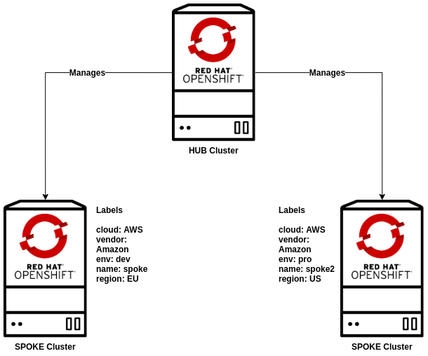

# Environments

If you're using `RHPDS` for getting an environment for the lab you can jump directly to the `Environment Overview` section, in case you don't have access to `RHPDS` keep reading to know what you need to proceed with the lab.

1. Deploy an OpenShift 4.3.9+ cluster and deploy Red Hat Advanced Cluster Manager for Kubernetes on top of it
2. Deploy two OpenShift 4.3+ clusters and configure them as managed clusters on ACM, make sure that you use the same names and labels from `Environment Overview` section
3. Merge the three Kubeconfigs (one for each cluster) using the instructions from `OC Tool Context Configuration` section

You can follow the official docs in order to deploy OpenShift as well as ACM, those items are out of scope for this lab.

# Environment Overview

**OpenShift Clusters**

* 1 x HUB Cluster Running OCP 4.5.4
  * ACM Version Used: 2.0.0
* 1 x Managed Cluster Running OCP 4.5.4
  * Cluster Name: managed-cluster1-dev
  * Cluster Labels: 
    * cloud: AWS
    * environment: **dev**
    * Additional labels
      * region: EU
* 1 x Managed Cluster Running OCP 4.5.4
  * Cluster Name: managed-cluster2-prod
  * Cluster Labels:
    * cloud: AWS
    * environment: **prod**
    * Additional labels
      * region: US

**GitOps Repository**

* Repository URL: https://github.com/RHsyseng/acm-app-lifecycle-policies-lab
* Repository Branches:
  * master -> Stores the ACM Manifests used during this write-up
  * config -> Stores the base files for our APPs that apply to every environment
  * stage  -> Stores the overlay files for our APPs that apply to staging environments
  * prod   -> Stores the overlay files for our APPs that apply to production environments
  * infra  -> Stores manifests related to cluster infrastructure

# Browser

We recommend to use a recent web browser in order to access the different web consoles during the lab.

There are known issues with displaying content properly using older browsers.

---

**Continue to [Importing Managed Clusters into ACM](./01_importing_managed_clusters.md)**

**Go [Home](./README.md)**