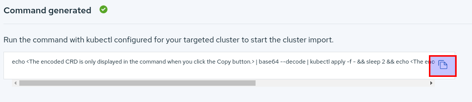
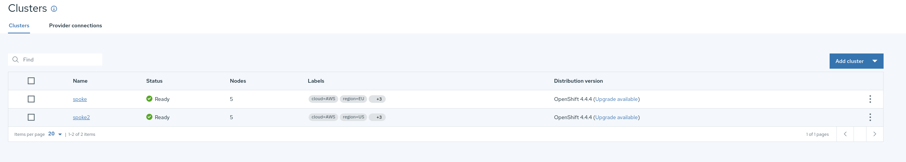

# OC Tool Context Configuration

>  **NOTE:** You must complete this section before importing the clusters on ACM

The following steps will leverage the usage of `contexts` within the `oc` tool.

We will be using three contexts:

* `hub`    -> Context for accessing HUB Cluster 
* `managed-dev`  -> Context for accessing Development Managed Cluster
* `managed-prod` -> Context for accessing Production Managed Cluster

## RHPDS Users

You should have three emails with the access details for the different environments, the `Hub` cluster and the two `Managed` clusters. Now, you need to create a new Kubeconfig and merge all credentials. You can follow the example below using the information received by RHPDS.

### Credentials Example

You can run these steps from your laptop if you have the `oc tool` installed, or from the `bastion` host provided by RHPDS.

 **NOTE:** Remember to use the credentials provided by the RHPDS platform

 **NOTE:** Pay special attention when creating the HUB cluster context, it needs to match the cluster where ACM is running, managed clusters order is not important

1. Create the new Kubeconfig file and export it

    ~~~sh
    touch /var/tmp/acm-lab-kubeconfig
    export KUBECONFIG=/var/tmp/acm-lab-kubeconfig
    ~~~
2. Login into the HUB cluster and rename the context

    ~~~sh
    oc login --insecure-skip-tls-verify=true --username=<admin_user> --password=<admin_password> https://api.<hub_cluster_name>.<base_domain>:6443
    oc config rename-context $(oc config current-context) hub
    sed -i "s/admin$/admin-hub/" /var/tmp/acm-lab-kubeconfig
    ~~~
3. Login into the managed dev cluster

    ~~~sh
    oc login --insecure-skip-tls-verify=true --username=<admin_user> --password=<admin_password> https://api.<managed1_cluster_name>.<base_domain>:6443
    oc config rename-context $(oc config current-context) managed-dev
    sed -i "s/admin$/admin-managed-dev/" /var/tmp/acm-lab-kubeconfig
    ~~~
4. Login into the managed prod cluster

    ~~~sh
    oc login --insecure-skip-tls-verify=true --username=<admin_user> --password=<admin_password> https://api.<managed1_cluster_name>.<base_domain>:6443
    oc config rename-context $(oc config current-context) managed-prod
    sed -i "s/admin$/admin-managed-prod/" /var/tmp/acm-lab-kubeconfig
    ~~~

## Bring Your Own Environment Users

If you have been provided with Kubeconfig files for accessing the clusters you need to merge those into a single one. If you don't know how to merge your Kubeconfigs and create the contexts you can refer to [this documentation](https://openshift.tips/oc/#merge-multiple-kubeconfigs).

If you have been provided with user/password credentials for accessing the clusters, you can create the different contexts following the example above with the credentials you got.

# Importing Managed Clusters into ACM

## Hub and Managed Clusters

During the lab we will refer to Hub and Managed Clusters. **Hub** cluster is where ACM is running, **Managed** clusters are being managed by a **Hub** cluster.

## Importing Clusters into ACM

At this point, you should have 1 x HUB Cluster with ACM running and 2 x Managed Clusters. We are going to login into the ACM Console and import the clusters.

1. Login into the ACM WebUI with the admin credentials for the HUB Cluster, the url should be something like this: `https://multicloud-console.apps.<cluster_name>.<base_domain>`
2. On the left menu click on `Automate infrastructure` -> `Clusters`
3. Click on `Add cluster` -> `Import and existing cluster`
4. Import the first managed cluster with the following details
    1. `Cluster Name`: managed-cluster1-dev
    2. Configure the following labels
        
        * cloud: AWS
        * environment: **dev**
        * Additional labels
            * region: EU
    3. Click on `Generate command`
    4. Click on the `Copy command icon`

        
    5. Change the `oc tool` context to `managed-dev` and run the command
        1. Change to the `managed-dev` context on your oc tool

            ~~~sh
            oc config use managed-dev
            ~~~
        2. Paste the command you just copied into your terminal
    6. The cluster will be imported in a few minutes
5. Import the second managed cluster with the following details
    1. `Cluster name`: managed-cluster2-prod
    2. Configure the following labels
        
        * cloud: AWS
        * environment: **prod**
        * Additional labels
            * region: US
    3. Click on `Generate command`
    4. Click on the `Copy command icon`

        
    5. Change the `oc tool` context to `managed-prod` and run the command
        1. Change to the `managed-prod` context on your oc tool

            ~~~sh
            oc config use managed-prod
            ~~~
        2. Paste the command you just copied into your terminal
    6. The cluster will be imported in a few minutes
6. After the two clusters are imported you should see them on the ACM WebUI under `Automate infrastructure` -> `Clusters`:

    

---

**Continue to [Introduction to GitOps on ACM](./02_introduction_to_gitops.md)**

**Back to [Environment Overview](./00_environment_overview.md)**

**Go [Home](./README.md)**
