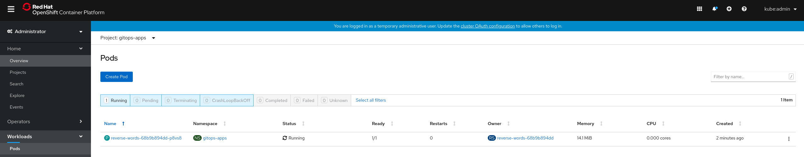
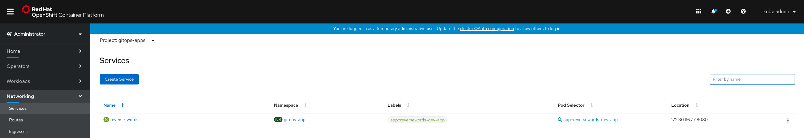
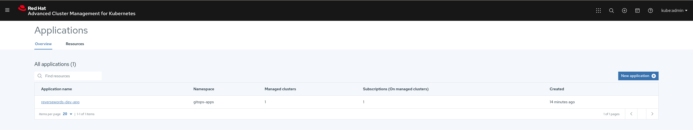
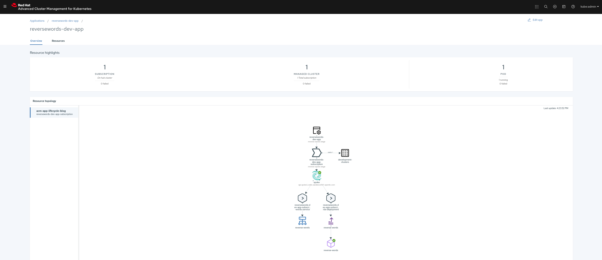

# Deploying Applications to Multiple Clusters

## **Sending an Application to the Dev Clusters**

In this use case we are going to deploy a sample application to our `development` clusters, that means that we're going to target clusters labeled as `env: dev`.

Let's explore the different ACM components we will be using in this example: `Channel`, `PlacementRule`, `Application` and `Subscription`:

 **NOTE:** You don't have to create the files below, we are just reviewing the ACM manifests

1. A `Channel` named `acm-gitops-github` will be created, it is a `GitHub` type channel and points to [this](https://github.com/RHsyseng/acm-app-lifecycle-policies-lab.git) Git repository

    ~~~yaml
    apiVersion: apps.open-cluster-management.io/v1
    kind: Channel
    metadata:
      name: acm-gitops-github
      namespace: gitops-apps
    spec:
      type: GitHub
      pathname: https://github.com/RHsyseng/acm-app-lifecycle-policies-lab.git
    ~~~
2. A `PlacementRule` named `development-clusters` will be created, it will return only 1 cluster out of all our clusters labeled as `env: dev`

    ~~~yaml
    apiVersion: apps.open-cluster-management.io/v1
    kind: PlacementRule
    metadata:
      name: development-clusters
      namespace: gitops-apps
    spec:
      clusterConditions:
       - type: OK
      clusterSelector:
        matchExpressions: []
        matchLabels:
          env: "dev"
      clusterReplicas: 1
    ~~~
3. An `Application` named `reversewords-dev-app` will be created, the Application components will be the subscriptions labeled with `app: reversewords-dev-app`

    ~~~yaml
    apiVersion: app.k8s.io/v1beta1
    kind: Application
    metadata:
      name: reversewords-dev-app
      namespace: gitops-apps
    spec:
      componentKinds:
      - group: apps.open-cluster-management.io
        kind: Subscription
      descriptor: {}
      selector:
        matchExpressions:
        - key: app
          operator: In
          values:
          - reversewords-dev-app
    ~~~
4. A `Subscription` named `reversewords-dev-app-subscription` will be created:
    1. The app manifests are loaded from the channel `acm-gitops-github` created in the namespace `gitops-apps`
    2. The path inside the Git repository for our application is `apps/reversewords/`
    3. The branch used is `stage`
    4. The subscription will be deployed on all clusters reported by the `PlacementRule` named `development-clusters`

    ~~~yaml
    apiVersion: apps.open-cluster-management.io/v1
    kind: Subscription
    metadata:
      name: reversewords-dev-app-subscription
      namespace: gitops-apps
      labels:
        app: reversewords-dev-app
      annotations:
        apps.open-cluster-management.io/github-path: apps/reversewords/
        apps.open-cluster-management.io/github-branch: stage
    spec:
      channel: gitops-apps/acm-gitops-github
      placement:
        placementRef:
          kind: PlacementRule
          name: development-clusters
    ~~~

>  **NOTE:** Below commands should be run in HUB Cluster (where ACM is running)

1. Create a `Namespace` where we will store the ACM manifests for the application

    ~~~sh
    oc --context hub create -f https://github.com/RHsyseng/acm-app-lifecycle-policies-lab/raw/master/acm-manifests/reversewords-kustomize/00_namespace.yaml
    ~~~
2. Create a `Channel` defining our GitHub repository as the source of truth for the application

    ~~~sh
    oc --context hub create -f https://github.com/RHsyseng/acm-app-lifecycle-policies-lab/raw/master/acm-manifests/reversewords-kustomize/01_channel.yaml
    ~~~
3. Create a `PlacementRule` matching our `development` clusters (labeled as `env: dev`)

    >  **NOTE:** In our `PlacementRule` we are defining `clusterReplicas: 1`, that means that even if we have more than 1 cluster that matches the labels defined in the `PlacementRule`, the `PlacementRule` will only return 1 of them back

    ~~~sh
    oc --context hub create -f https://github.com/RHsyseng/acm-app-lifecycle-policies-lab/raw/master/acm-manifests/reversewords-kustomize/02_placement_rule-dev.yaml
    ~~~
4. Create an `Application` and a `Subscription` for deploying our app onto the `development` clusters

    ~~~sh
    oc --context hub create -f https://github.com/RHsyseng/acm-app-lifecycle-policies-lab/raw/master/acm-manifests/reversewords-kustomize/03_subscription-dev.yaml
    ~~~

Let's explore the status for our `PlacementRule` and `Subscription`:

1. Get `PlacementRule` matched clusters

    ~~~sh
    oc --context hub -n gitops-apps get placementrule development-clusters -o yaml
    ~~~
    > As you can see in the `status` we are matching cluster named `spoke` which is our development cluster
    ~~~yaml
    apiVersion: apps.open-cluster-management.io/v1
    kind: PlacementRule
    metadata:
      creationTimestamp: "2020-04-06T15:39:36Z"
      generation: 1
      name: development-clusters
      namespace: gitops-apps
      resourceVersion: "74854"
      selfLink: /apis/apps.open-cluster-management.io/v1/namespaces/gitops-apps/placementrules/development-clusters
      uid: 91175961-aa16-4c26-a68e-5dc56046ed31
    spec:
      clusterConditions:
      - type: OK
      clusterReplicas: 1
      clusterSelector:
        matchExpressions: []
        matchLabels:
          env: dev
    status:
      decisions:
      - clusterName: spoke
        clusterNamespace: spoke
    ~~~
2. Get Subscription status
    
    ~~~sh
    oc --context hub -n gitops-apps get subscription reversewords-dev-app-subscription -o yaml
    ~~~
    > As you can see in the `status` we are sending the application to the cluster named spoke and the subscription is propagated to the cluster already
    ~~~yaml
    apiVersion: apps.open-cluster-management.io/v1
    kind: Subscription
    metadata:
      annotations:
        apps.open-cluster-management.io/github-branch: stage
        apps.open-cluster-management.io/github-path: apps/reversewords/
      creationTimestamp: "2020-04-06T15:47:45Z"
      generation: 1
      labels:
        app: reversewords-dev-app
      name: reversewords-dev-app-subscription
      namespace: gitops-apps
      resourceVersion: "80585"
      selfLink: /apis/apps.open-cluster-management.io/v1/namespaces/gitops-apps/subscriptions/reversewords-dev-app-subscription
      uid: 822c18f8-1bca-4677-a40d-37f0e7faee81
    spec:
      channel: gitops-apps/acm-gitops-github
      placement:
        placementRef:
          kind: PlacementRule
          name: development-clusters
    status:
      lastUpdateTime: "2020-04-06T15:47:47Z"
      phase: Propagated
      statuses:
        spoke: {}
    ~~~

Now we should have our application running on the development cluster, we are going to explore the deployed bits using three methods:

1. Using the `oc` command

    >  **NOTE:** It could take a few moments (up to 2 minutes) for the Subscription to be propagated to the managed cluster.

    ~~~sh
    oc --context spoke -n gitops-apps get pods,svc,route
    ~~~

    ~~~sh
    NAME                                READY   STATUS    RESTARTS   AGE
    pod/reverse-words-7dd94446c-tbbt8   1/1     Running   0          37s

    NAME                    TYPE        CLUSTER-IP      EXTERNAL-IP   PORT(S)    AGE
    service/reverse-words   ClusterIP   172.30.137.40   <none>        8080/TCP   102s

    NAME                                     HOST/PORT                                                         PATH   SERVICES        PORT   TERMINATION   WILDCARD
    route.route.openshift.io/reverse-words   reverse-words-gitops-apps.apps.cluster-6e02.red.osp.opentlc.com          reverse-words   8080                 None
    ~~~
2. Using the OCP Console
    >  **NOTE:** From ACM WebUI under `Clusters` view you can click on the three dots next to the cluster name you want to access and click on `Launch to cluster` in order to get to the OCP Cluster Console directly
    1. Login into the first Managed cluster (`env:dev`) OCP console and go to `Workloads -> Pods`
    2. Select the Project `gitops-apps` and you will see our application pod
        
    3. Go to `Networking -> Services`
    4. Select the Project `gitops-apps` and you will see our application service
        
3. Using the ACM Console
    1. Login into ACM Console with the admin credentials for the HUB Cluster, the url should be something like this: `https://multicloud-console.apps.<cluster_name>.<base_domain>`
    2. Go to `Menu -> Manage Applications`
    3. From the application list select `reversewords-dev-app`
        
        
    4. Here you will see the application topology
        
        

We can see that the application was not deployed to production cluster (as expected):

~~~sh
oc --context spoke2 -n gitops-apps get pods,svc,route
~~~

~~~sh
No resources found in gitops-apps namespace.
~~~

We can now access the deployed application:

~~~sh
curl http://$(oc --context spoke -n gitops-apps get route reverse-words -o jsonpath='{.status.ingress[0].host}')
~~~

~~~sh
Reverse Words Release: Stage release v0.0.3. App version: v0.0.3
~~~

>  **NOTE:** During the next examples we're not going to explore the different components like we just did, feel free to run the same exploratory commands in the next exercises, that will help you to get familiar with the different APIs used by ACM.

## **Sending an Application to the Prod Clusters**

In this use case we are going to deploy the same sample application we deployed to our `development` clusters, but this time we are targeting clusters labeled as `env: pro`.

As we already created the `Namespace` and the `Channel` for the previous use case, in this one we only need to create the `PlacementRule`, the `Application` and the `Subscription`

1. Create a `PlacementRule` matching our `production` clusters (labeled as `env: pro`)

    >  **NOTE:** In our `PlacementRule` we are defining `clusterReplicas: 1`, that means that even if we have more than 1 cluster that matches the labels defined in the `PlacementRule`, the `PlacementRule` will only return 1 of them back

    ~~~sh
    oc --context hub create -f https://github.com/RHsyseng/acm-app-lifecycle-policies-lab/raw/master/acm-manifests/reversewords-kustomize/04_placement_rule-prod.yaml
    ~~~
2. Create an `Application` and a `Subscription` for deploying our app onto the `production` clusters

    ~~~sh
    oc --context hub create -f https://github.com/RHsyseng/acm-app-lifecycle-policies-lab/raw/master/acm-manifests/reversewords-kustomize/05_subscription-prod.yaml
    ~~~

Let's explore the `Application` and `Subscription` manifests.

1. An `Application` named `reversewords-pro-app` will be created, the Application components will be the subscriptions labeled with `app: reversewords-pro-app`
2. A `Subscription` named `reversewords-pro-app-subscription` will be created:
    1. The app manifests are loaded from the channel `acm-gitops-github` created in the namespace `gitops-apps`
    2. The path inside the Git repository for our application is `apps/reversewords/`
    3. The branch used is `prod`
    4. The subscription will be deployed on all clusters reported by the `PlacementRule` named `production-clusters`

Now we should have our application running on the production cluster:

>  **NOTE:** We're using `oc` tool in order to verify the app deployment. Feel free to review the application on the ACM Console as well.

>  **NOTE:** It could take a few moments (up to 2 minutes) for the Subscription to be propagated to the managed cluster.

~~~sh
oc --context spoke2 -n gitops-apps get pods,svc,route
~~~

~~~sh
NAME                                READY   STATUS    RESTARTS   AGE
pod/reverse-words-7dd94446c-5vchj   1/1     Running   0          2m11s

NAME                    TYPE        CLUSTER-IP       EXTERNAL-IP   PORT(S)    AGE
service/reverse-words   ClusterIP   172.30.216.213   <none>        8080/TCP   2m11s

NAME                                     HOST/PORT                                                         PATH   SERVICES        PORT   TERMINATION   WILDCARD
route.route.openshift.io/reverse-words   reverse-words-gitops-apps.apps.cluster-8aca.red.osp.opentlc.com          reverse-words   8080                 None
~~~

We can now access the deployed application:

~~~sh
curl http://$(oc --context spoke2 -n gitops-apps get route reverse-words -o jsonpath='{.status.ingress[0].host}')
~~~

~~~sh
Reverse Words Release: Production release v0.0.2. App version: v0.0.2
~~~

As you can see we deployed a different release and app version to our production cluster.

## **Sending an Application to all Clusters**

In this use case we are going to deploy the sample application to all clusters that report an `OK` health status.

1. To avoid app creation collisions we are going to delete previous subscriptions and applications

    ~~~sh
    oc --context hub delete -f https://github.com/RHsyseng/acm-app-lifecycle-policies-lab/raw/master/acm-manifests/reversewords-kustomize/03_subscription-dev.yaml
    oc --context hub delete -f https://github.com/RHsyseng/acm-app-lifecycle-policies-lab/raw/master/acm-manifests/reversewords-kustomize/05_subscription-prod.yaml
    ~~~
2. Create a `PlacementRule` matching all healthy clusters (reported back as `Cluster Condition - OK`)

    ~~~sh
    oc --context hub create -f https://github.com/RHsyseng/acm-app-lifecycle-policies-lab/raw/master/acm-manifests/reversewords-kustomize/06_placement_rule-all-okay.yaml
    ~~~
3. Create the `Application` and the `Subscription` for deploying the production release of our application to all healthy clusters

    ~~~sh
    oc --context hub create -f https://github.com/RHsyseng/acm-app-lifecycle-policies-lab/raw/master/acm-manifests/reversewords-kustomize/07_subscription-all-okay.yaml
    ~~~

Now we should have our application running on the `development` and `production` clusters since all our clusters are healthy

>  **NOTE:** We're using `oc` tool in order to verify the app deployment. Feel free to review the application on the ACM Console as well.

>  **NOTE:** It could take a few moments (up to 2 minutes) for the Subscription to be propagated to the managed cluster.

~~~sh
# Get Spoke data (managed dev cluster)
oc --context spoke -n gitops-apps get pods,svc,route
~~~

~~~sh
NAME                                READY   STATUS    RESTARTS   AGE
pod/reverse-words-7dd94446c-5lw6n   1/1     Running   0          21s

NAME                    TYPE        CLUSTER-IP       EXTERNAL-IP   PORT(S)    AGE
service/reverse-words   ClusterIP   172.30.252.209   <none>        8080/TCP   21s

NAME                                     HOST/PORT                                                         PATH   SERVICES        PORT   TERMINATION   WILDCARD
route.route.openshift.io/reverse-words   reverse-words-gitops-apps.apps.cluster-6e02.red.osp.opentlc.com          reverse-words   8080                 None
~~~

~~~sh
# Get Spoke2 data (managed prod cluster)
oc --context spoke2 -n gitops-apps get pods,svc,route
~~~

~~~sh
NAME                                READY   STATUS    RESTARTS   AGE
pod/reverse-words-7dd94446c-v55dj   1/1     Running   0          2m3s

NAME                    TYPE        CLUSTER-IP     EXTERNAL-IP   PORT(S)    AGE
service/reverse-words   ClusterIP   172.30.23.99   <none>        8080/TCP   2m4s

NAME                                     HOST/PORT                                                         PATH   SERVICES        PORT   TERMINATION   WILDCARD
route.route.openshift.io/reverse-words   reverse-words-gitops-apps.apps.cluster-8aca.red.osp.opentlc.com          reverse-words   8080                 None
~~~

We can now access our applications and see how we're deploying the production release to both clusters:

~~~sh
# Get Development App
curl http://$(oc --context spoke -n gitops-apps get route reverse-words -o jsonpath='{.status.ingress[0].host}')
~~~

~~~sh
Reverse Words Release: Production release v0.0.2. App version: v0.0.2
~~~

~~~sh
# Get Production App
curl http://$(oc --context spoke2 -n gitops-apps get route reverse-words -o jsonpath='{.status.ingress[0].host}')
~~~

~~~sh
Reverse Words Release: Production release v0.0.2. App version: v0.0.2
~~~

---

<!--**Continue to [Using TimeWindows](./03_using_timewindows.md)** -->
**Continue to [Disaster Recovery](./05_disaster_recovery.md)**

**Back to [Introduction to GitOps on ACM](./02_introduction_to_gitops.md)** 

**Go [Home](./README.md)**
