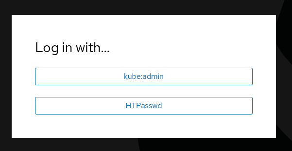
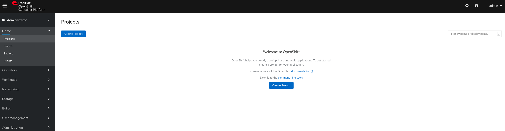

# Configuring Infrastructure using Apps

So far, we have used GitOps patterns to deploy applications in our different clusters. Now we are going to explore how we can leverage GitOps patterns to configure
our infrastructure.

For this lab, we will be adding `HTpasswd` authentication to our `development` clusters. 

We have generated a very secure password, `changeme`, and defined a user `admin` which will be able to login.

Next, the `Policy` file defining the required `Secret` and `OAuth` configuration has been uploaded to Git (remember, don't upload plain secrets to Git!! Use SealedSecrets or Vault instead).

* [Dev Clusters HTPass Auth Policy](https://github.com/RHsyseng/acm-app-lifecycle-policies-lab/blob/infra/authentication/dev-clusters-htpass-auth-policy.yaml)

1. Create a new Namespace in the hub cluster for storing the Day 2 Operations policies for the infrastructure configuration

    ~~~sh
    oc --context hub create namespace day2ops-policies
    ~~~
2. Load the subscription which will create the policies in the hub cluster

    ~~~sh
    oc --context hub create -f https://github.com/RHsyseng/acm-app-lifecycle-policies-lab/raw/master/acm-manifests/infra-gitops/00_dev-clusters-htpass-auth-subscription.yaml
    ~~~
3. Get the development cluster console URL

    ~~~sh
    oc --context managed-dev -n openshift-console get route console -o jsonpath='{.spec.host}'
    ~~~
4. Open the console URL in your browser and you will get a new option to authenticate using HTPass users

    
5. You can now login using user `admin` and password `changeme`

    

---

**Continue to [Introduction to Policies on ACM](./07_introduction_to_policies.md)**

**Back to [Disaster Recovery](./05_disaster_recovery.md)** 

**Go [Home](./README.md)**