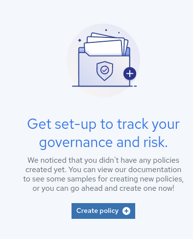
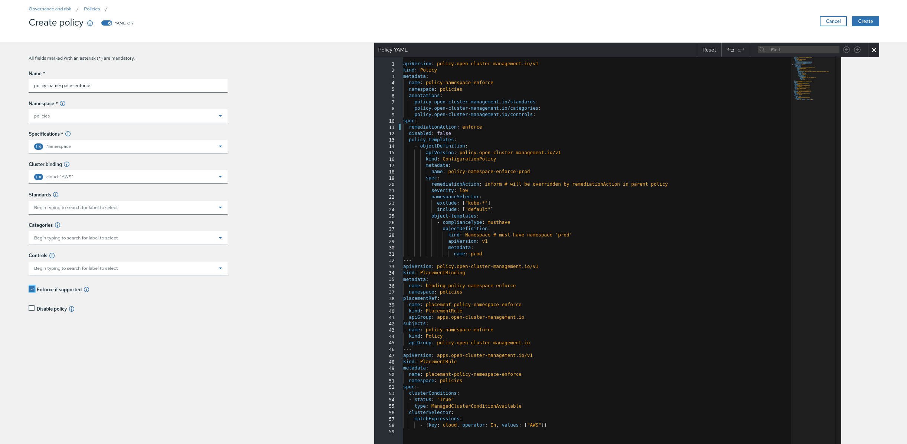
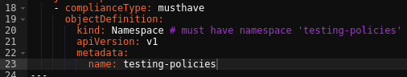
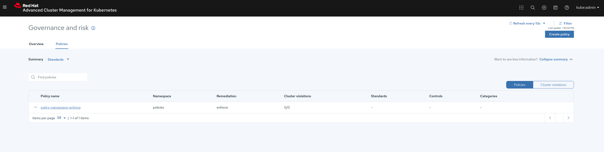
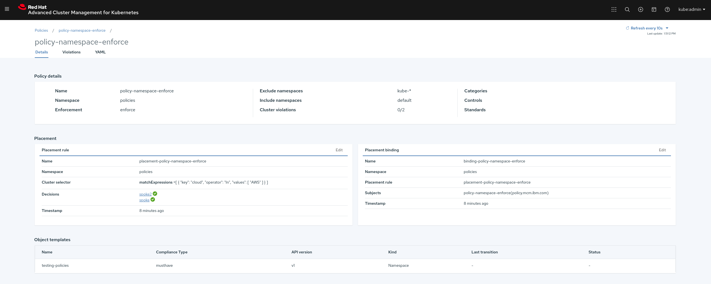
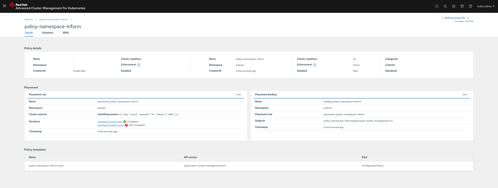
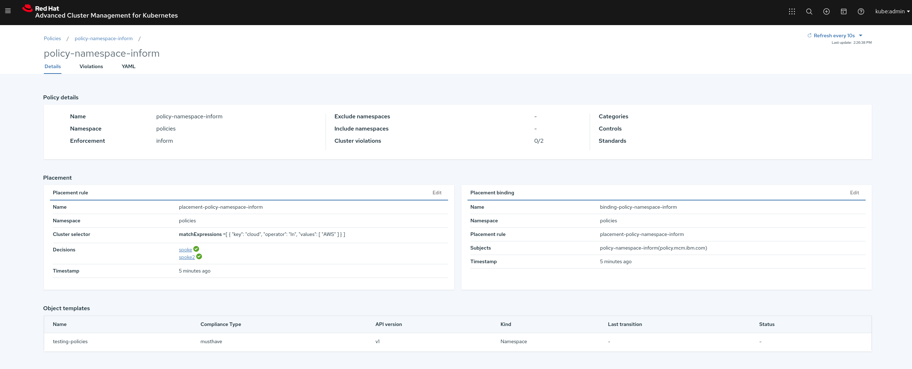

# Applying Policies

In the next examples we are going to create some policies. ACM features a complete WebUI that you can use to create policies using a wizard. We're going to explore this wizard for our first Policy only.

In order to store our Policies we're going to create a namespace. On the hub cluster run the following command:

~~~sh
oc --context hub create -f https://github.com/RHsyseng/acm-app-lifecycle-policies-lab/raw/master/acm-manifests/policies/00_namespace.yaml
~~~

## **Namespace must exist on the AWS clusters (Enforce)**

This policy will ensure a namespace named `testing-policies` exists on all the AWS clusters (labeled as `cloud: AWS`). In case the namespace doesn't exist, it will be created automatically.

1. Login into ACM
2. Go to `Govern risk`
3. Click on `Create Policy`

    
4. The Policy creation Wizard will load, configure the following policy
    
    1. Name: `policy-namespace-enforce`
    2. Namespace: `policies`
    3. Specifications: `Namespace - must have namespace 'prod'`
    4. Cluster binding: `cloud: "AWS"`
    5. Standards: `Uncheck the selected items`
    6. Categories: `Uncheck the selected items`
    7. Controls: `Uncheck the selected items`
    8. Enforce if supported: `Marked`
    9. Disable policy: `Unmarked`
5. At this point your wizard should look like this

    
6. We want to ensure a namespace named `testing-policies` exists, so we need to edit the yaml a bit

    >  **NOTE:** We replaced `prod` by `testing-policies`
    
    
7. Before hitting `Create` let's check if `testing-policies` namespace exists in our AWS clusters named managed-cluster1-dev and managed-cluster2-prod

    ~~~sh
    # Check development managed cluster
    oc --context managed-dev get ns testing-policies
    
    Error from server (NotFound): namespaces "testing-policies" not found
    
    # Check production managed cluster
    oc --context managed-prod get ns testing-policies
    
    Error from server (NotFound): namespaces "testing-policies" not found
    ~~~
8. Now click `Create` in order to load the policy
9. You will be redirected to the Policy overview where you will see a list of all the policies

    
10. If you click on your policy, you will see the policy status

    
11. As you can see our two clusters are compliant with the policy, let's check if the `testing-policies` namespace exists now

    ~~~sh
    # Check development managed cluster
    oc --context managed-dev get ns testing-policies
    
    NAME               STATUS   AGE
    testing-policies   Active   107s
    
    # Check production managed cluster
    oc --context managed-prod get ns testing-policies
    
    NAME               STATUS   AGE
    testing-policies   Active   114s
    ~~~
12. Since the policy was configured in `enforce` mode, ACM went ahead and created the namespaces in our clusters so they are compliant with the policy
13. We can use the `oc` tool in order to check the status of our policies as well

    ~~~sh
    oc --context hub -n policies get policy -o yaml policy-namespace-enforce
    ~~~
    
    ~~~yaml
    <OUTPUT_OMITTED>
    status:
      placement:
      - placementBinding: binding-policy-namespace-enforce
        placementRule: placement-policy-namespace-enforce
      status:
      - clustername: managed-cluster1-dev
        clusternamespace: managed-cluster1-dev
        compliant: Compliant
      - clustername: managed-cluster2-prod
        clusternamespace: managed-cluster2-prod
        compliant: Compliant
    ~~~

As we did during the Application Lifecycle examples, policies can be loaded from yaml files as well, the policy we just created in this example using the WebUI could have been created using the following command:

~~~sh
oc --context hub create -f https://github.com/RHsyseng/acm-app-lifecycle-policies-lab/raw/master/acm-manifests/policies/01_namespace_must_exists_enforce.yaml
~~~

>  **NOTE:** During the next examples we're not going to explore the different components like we just did, feel free to run the same exploratory commands in the next exercises, that will help you to get familiar with the different APIs used by ACM.

>  **NOTE:** Following exercises will load policies from a yaml file directly, feel free to explore the yaml files before creating the policy in order to understand how the policy is configured.

## **Namespace must exist on the AWS clusters (Inform)**

In this policy we're going to create the same policy we created before, but instead of `enforcing` it, we will configure it as `inform`. Before creating this new policy we're going to delete the previous policy and remove the `testing-policies` namespace from one of the clusters.

1. Delete the previous policy

    ~~~sh
    oc --context hub delete -f https://github.com/RHsyseng/acm-app-lifecycle-policies-lab/raw/master/acm-manifests/policies/01_namespace_must_exists_enforce.yaml
    ~~~
2. Delete the namespace from managed production cluster

    ~~~sh
    oc --context managed-prod delete namespace testing-policies
    ~~~

Now we can create the policy which will ensure a namespace named `testing-policies` exists on all the AWS clusters (labeled as `cloud: AWS`). In case the namespace doesn't exist, the cluster will be marked as non-compliant.

~~~sh
oc --context hub create -f https://github.com/RHsyseng/acm-app-lifecycle-policies-lab/raw/master/acm-manifests/policies/02_namespace_must_exists_inform.yaml
~~~

Now if we look in the WebUI we will see that the managed production cluster is not compliant with the policy:

If we create the namespace we will see how the cluster moves to compliant:

1. Create the namespace

    ~~~sh
    oc --context managed-prod create namespace testing-policies
    ~~~
2. The cluster should move to compliant

    

## **Deployment must exist on a given namespace and cluster (Inform)**

This policy will ensure a deployment named `cluster-monitoring-operator` exists in the namespace `openshift-monitoring` for production clusters (labeled as `environment: prod`). In case the deployment doesn't exist, the cluster will be marked as non-compliant.

~~~sh
oc --context hub create -f https://github.com/RHsyseng/acm-app-lifecycle-policies-lab/raw/master/acm-manifests/policies/03_deployment_must_exists_inform.yaml
~~~

## **Pod must exist on a given namespace and cluster (Enforce)**

This policy will ensure a nginx pod exists in the namespace default for development clusters (labeled as `environment: dev`). In case the pod doesn't exists, it will be created automatically.

~~~sh
oc --context hub create -f https://github.com/RHsyseng/acm-app-lifecycle-policies-lab/raw/master/acm-manifests/policies/04_pod_must_exists_enforce.yaml
~~~

## **Limit Memory Range on a given namespace and cluster**

This policy will ensure that Pods have default memory `requests` and `limits` in the given Namespace. This policy will target the production clusters (labeled as `environment: prod`) and the namespace `default`.

The Policy will add default memory `requests` and `limits` to containers which do not provide resource configuration.

~~~sh
oc --context hub create -f https://github.com/RHsyseng/acm-app-lifecycle-policies-lab/raw/master/acm-manifests/policies/05_memory_limitrange.yaml
~~~

1. We are going to create a test deployment in the `managed-prod` cluster where the Policy was created

    ~~~sh
    cat <<EOF | oc --context managed-prod -n default create -f -
    apiVersion: apps/v1
    kind: Deployment
    metadata:
      labels:
        app: policy-test
      name: policy-test
    spec:
      replicas: 1
      selector:
        matchLabels:
          app: policy-test
      strategy: {}
      template:
        metadata:
          labels:
            app: policy-test
        spec:
          containers:
          - image: quay.io/mavazque/reversewords:latest
            name: reversewords
            resources: {}
    EOF
    ~~~
2. We created the deployment without specifying any `resources` for the container, but the Policy forced the defaults

    ~~~sh
    oc --context managed-prod -n default get pods -l app=policy-test -o jsonpath='{.items[*].spec.containers[*].resources}'
    ~~~

    ~~~sh
    map[limits:map[memory:512Mi] requests:map[memory:256Mi]]
    ~~~

---

**Back to [Introduction to Policies on ACM](./07_introduction_to_policies.md)** 

**Go [Home](./README.md)**